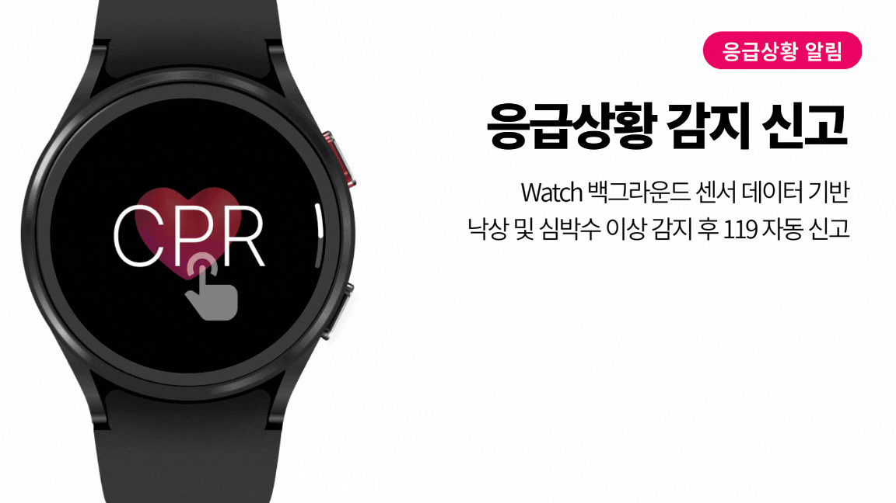
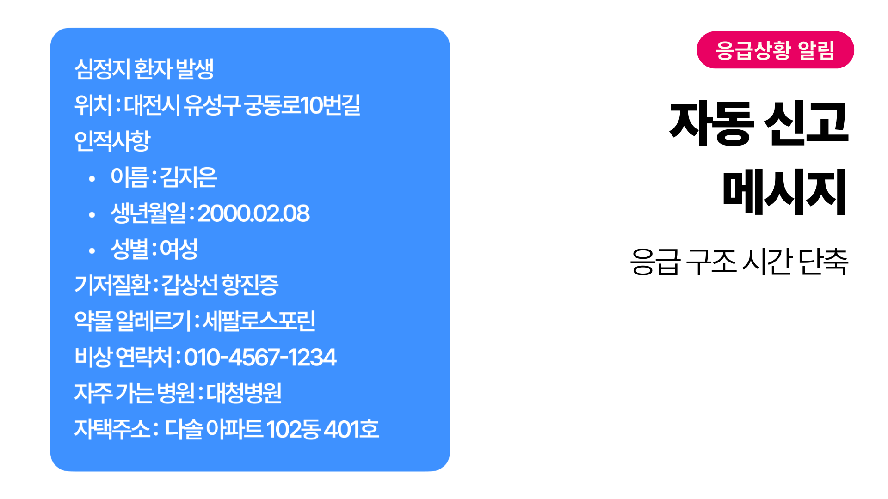
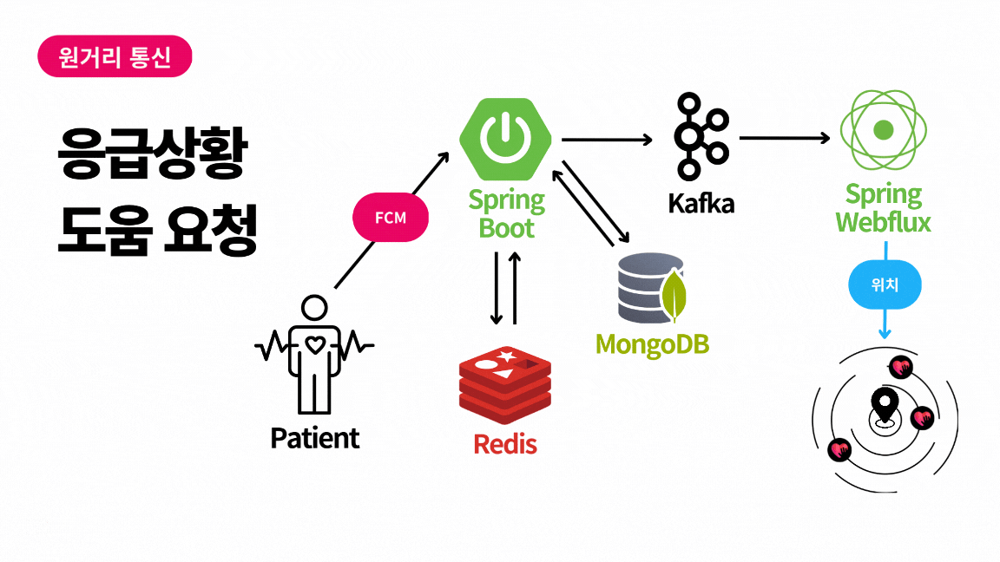
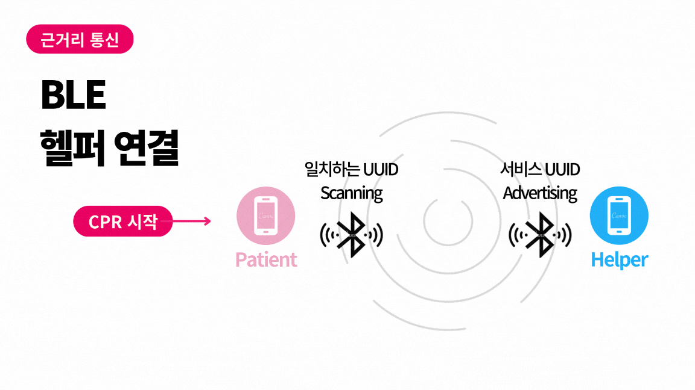
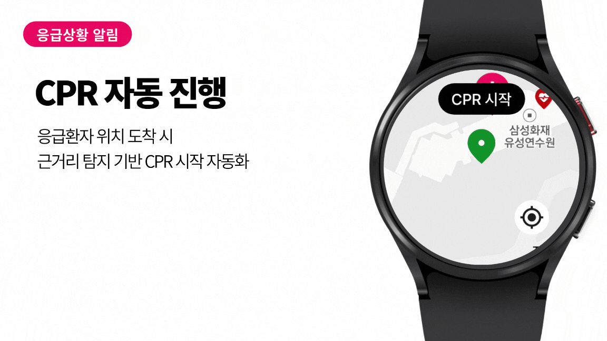
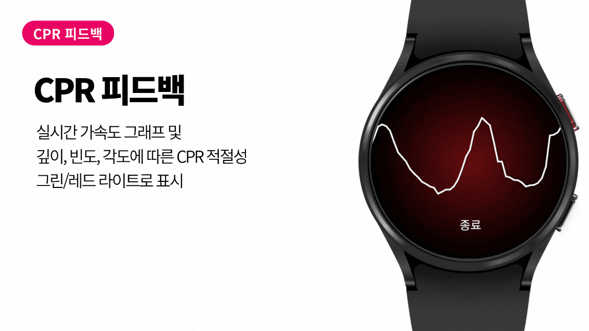
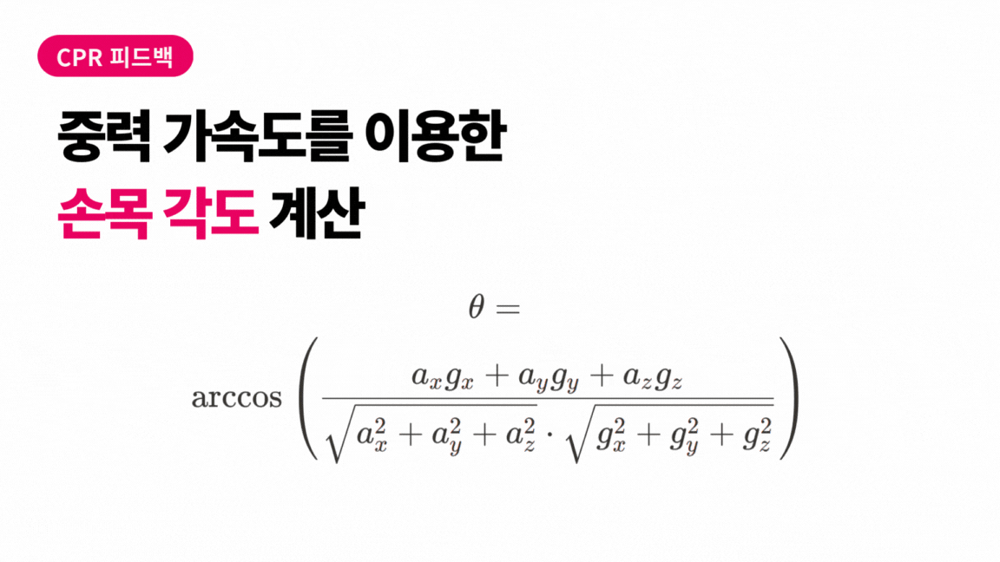
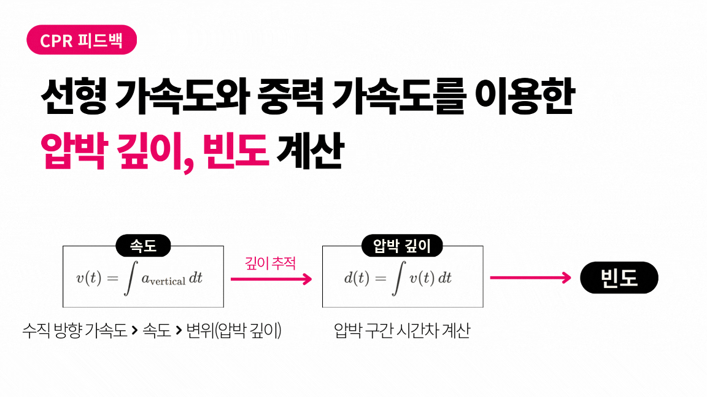
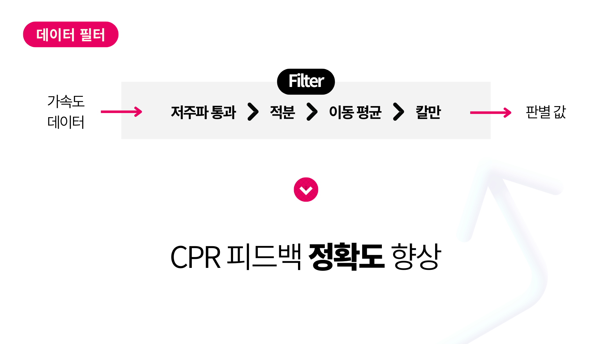
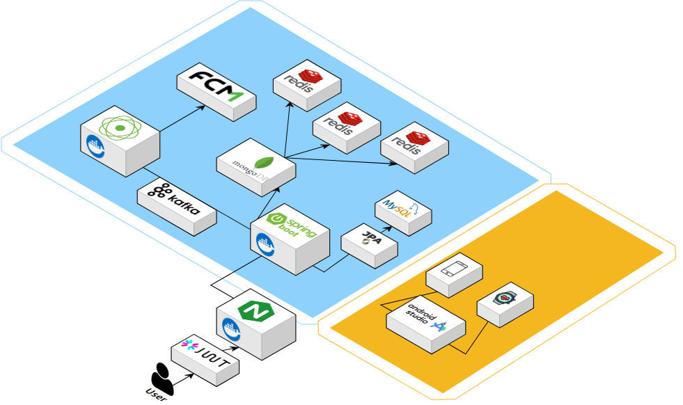

# 💞응급 구조 보조 서비스(CPR 가이드) : PushOfLife💓

## 📑목차
1. 개요
2. 서비스 소개
3. 주요 기능
4. 프로젝트 산출물
5. 기술 스택 및 개발 환경
6. 팀원 및 역할

## 🚩개요
- 진행 기간 : 2024.10.14 ~ 2024.11.22 (6주)
- 서비스명 : PushOfLife
- 서비스 소개 : 갤럭시 워치를 활용한 응급 상황 **자동 감지** 및 **신속 구조** 지원

## 💡서비스 소개
&nbsp;본 서비스는 Wear OS 기반 웨어러블 디바이스를 활용하여 CPR 가이드와 응급 상황 통신 시스템을 통합한 새로운 응급 대응 솔루션을 제안한다. CPR 가이드는 센서 데이터를 기반으로 압박 깊이, 빈도, 팔 각도를 실시간으로 분석하며, 이를 통해 사용자가 CPR을 올바르게 수행할 수 있도록 지속적인 피드백을 제공한다. 가속도계와 중력 데이터를 활용한 3D 벡터 계산과 저주파 필터, 칼만 필터 등의 기법을 적용하여 CPR의 정확도를 향상시키고, 음성 및 시각적 안내를 실시간으로 제공한다.    
  
&nbsp;응급 상황 통신 시스템은 워치에서 응급 상황이 감지되면 서버로 정보를 전송하고, 환자 주변 300m 이내의 사용자들에게 실시간 알림을 보낸다. Redis의 GEO Spatial 쿼리와 MongoDB 기반의 FCM 토큰 관리를 통해 데이터 처리 속도를 최적화하였으며, 알림을 받은 헬퍼는 BLE 스캔을 통해 환자와 연결된다. BLE 매칭이 완료되면 헬퍼의 워치에서 자동으로 CPR 가이드가 활성화되며, 실시간 피드백을 제공한다.  
  
&nbsp;응급 상황에서 신속한 통신과 정확한 CPR 피드백을 동시에 제공함으로써 응급 대응의 효과성을 높이고, 병원 외 심정지 상황에서 생존율을 극대화할 가능성을 제시한다.
    

## ❣️주요 기능

응급 상황 감지 / 신고

  

심박수가 위험 수준 이하로 감소하거나 낙상이 감지될 경우 워치에서
경고음(사이렌)을 발생시키고, 3초간 반응이 없으면 등록된 응급 연락처와 구급대에 자동으로
알림을 발송한다. 모바일에서도 낙상 감지 기능을 활성화할 수 있으며, 모바일 기기에서는 30초
동안 반응이 없을 경우 자동으로 신고가 이루어진다.
  

낙상이나 심박수 이상이 감지될 경우, 모바일 앱에 미리 입력된 환자의 이름, 나이, 병력, 약물 알레르기 등의 정보를 구급대에 자동으로 전송한다. 헬퍼가 신고할
경우에도 신고자의 위치를 기반으로 구급대가 즉시 출동할 수 있도록 지원한다.

주변 유저 알림 기능

낙상이나 심박수 이상이 감지되었을 때 주변의 헬퍼들에게 즉시 긴급 알림을 발송한다. 헬퍼는 알림을 클릭하면 응급 환자의 위치와 주변 AED 위치를 워치 및 모바일
화면에서 시각적으로 확인할 수 있다. 이 기능은 헬퍼와 환자를 빠르게 연결하여 구조 활동이
지연되지 않도록 돕는다.

헬퍼의 CPR 가이드 자동화 기능

헬퍼가 환자의 워치 화면을 누르면 BLE 통신을 통해 CPR 가이드가 자동으로 헬퍼의 워치에 실행되도록 설계되었다. 또한, 헬퍼가 환자를 발견한 순간,
워치 타일을 이용해 간편하게 어플리케이션에 접근할 수 있어 추가적인 시간 소모 없이 즉각적인
CPR 지원을 시작할 수 있다.

CPR 피드백 및 실시간 가이드

 CPR의 각도, 빈도, 깊이를 분석하여 상세한 피드백을 제공한다. 헬퍼의 워치에서는 가속도 그래프를 통해 CPR의 정확도를 시각적으로 확인할 수 있으며,
환자의 워치에서는 실시간 심박수를 모니터링하여 CPR 진행 상황을 지원한다. 이를 통해 헬퍼가
적절한 CPR 리듬과 강도를 유지할 수 있도록 실시간으로 도움을 준다.

## 🎇프로젝트 산출물
1. [시퀀스 다이어그램 / 플로우 차트](https://www.figma.com/board/0me3wlmN98S2jQsRvEKxls/PushOfLife-%ED%94%8C%EB%A1%9C%EC%9A%B0-%2F-%EC%8B%9C%ED%80%80%EC%8A%A4-%EB%8B%A4%EC%9D%B4%EC%96%B4%EA%B7%B8%EB%9E%A8?node-id=0-1&t=hbI9DYjlXGrl1Wsn-1)
2. [화면 정의서](https://www.figma.com/design/fr1BBE9ckkxsdklZIgj6qE/PushOfLife-%ED%99%94%EB%A9%B4-%EC%A0%95%EC%9D%98%EC%84%9C?node-id=0-1&t=IY5YWw67Yjg1YYAK-1)

## 🛠️기술 스택 및 개발 환경

## 🏄팀원 및 역할

<table>
  <tr>
    <td align="center">
       
      <strong>최봉준</strong>
    </td>
    <td align="center">
       
      <strong>구고운</strong>
    </td>
  </tr>
  <tr>
    <td align="center"><strong>팀장 / WearOS</strong></td>
    <td align="center"><strong>WearOS</strong></td>
  </tr>
  <tr>
    <td align="center">
       
      <strong>김예운</strong>
    </td>
    <td align="center">
       
      <strong>윤채영</strong>
    </td>
  </tr>
  <tr>
    <td align="center"><strong>FE / Mobile</strong></td>
    <td align="center"><strong>FE / Mobile</strong></td>
  </tr>
  <tr>
    <td align="center">
       
      <strong>김수민</strong>
    </td>
    <td align="center">
       
      <strong>라송연</strong>
    </td>
  </tr>
  <tr>
    <td align="center"><strong>BE / INF</strong></td>
    <td align="center"><strong>BE / DB</strong></td>
  </tr>
</table>

